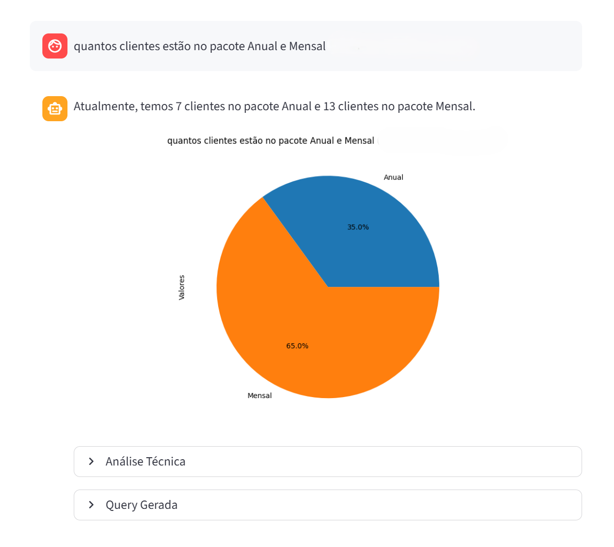

# SQL Agent 🔎



Um agente inteligente de análise de dados com arquitetura multi-agente, construído com LangGraph. Permite que usuários interajam com um banco de dados DuckDB através de perguntas em linguagem natural, com geração automática de queries SQL, ciclo de autocorreção e visualizações gráficas.

## Visão Geral ⚙️

O projeto é uma aplicação web que transforma perguntas em linguagem natural em consultas SQL executáveis, por meio de um pipeline de agentes especializados:

- **Validação de Entrada**: Classifica a pergunta do usuário antes de qualquer processamento (análise de dados, consulta ao catálogo ou bloqueio por segurança).
- **Geração de SQL com Autocorreção**: Um agente gera a query, outro valida e, se necessário, um revisor fornece feedback para reescrita com até 2 tentativas.
- **Interpretação dos Resultados**: O resultado da query é interpretado e devolvido em dois formatos: resposta formal para o usuário e análise técnica detalhada.
- **Geração Automática de Gráficos**: Com base nos dados retornados, o agente decide automaticamente se um gráfico (barra, pizza ou linha) agrega valor e o renderiza.
- **Interface de Chat**: Histórico de conversas persistente na sessão com exibição de SQL gerado e análise técnica em expansores.

## Arquitetura do Grafo

O pipeline é orquestrado pelo LangGraph com os seguintes nós:

- **validador**: Gatekeeper que classifica a entrada como `APROVADO`, `DEFINICAO` ou `REPROVADO`, bloqueando ou direcionando o fluxo antes de qualquer processamento.
- **perguntas**: Responde perguntas conceituais sobre planos e pacotes consultando exclusivamente o catálogo interno.
- **mapeador**: Lê dinamicamente o esquema do banco DuckDB e disponibiliza tabelas e colunas para o gerador de queries.
- **gerador_query**: Gera a consulta SQL com base no esquema e na pergunta, incorporando feedbacks do revisor quando disponíveis.
- **validador_query**: Verifica se a SQL gerada é capaz de responder corretamente à pergunta do usuário.
- **revisor**: Fornece feedback técnico detalhado para reescrita da SQL quando ela é rejeitada pelo validador.
- **executor**: Executa a SQL validada no DuckDB e retorna os resultados brutos.
- **interprete**: Analisa os resultados e gera uma resposta JSON com texto formal, análise técnica e tag de gráfico.
- **gerador_grafico**: Renderiza gráfico de barra, pizza ou linha com Matplotlib com base na tag definida pelo interprete.


## Características Principais

- 🔐 **Validação de Segurança**: Bloqueia tentativas de injeção de prompt, operações de escrita (`DELETE`, `UPDATE`, `INSERT`, `DROP`) e perguntas fora de escopo.
- 🧠 **Multi-Agente com LangGraph**: Cada etapa do pipeline tem um agente especializado com responsabilidade única.
- 🔄 **Ciclo de Autocorreção (Reflexão)**: Se a SQL gerada for rejeitada, o agente revisor fornece feedback e o gerador reescreve a query com até 2 iterações.
- 📖 **Catálogo de Definições**: Perguntas conceituais sobre planos e pacotes são respondidas diretamente por um agente especializado, sem acesso ao banco.
- 📊 **Visualizações Automáticas**: Gráficos de barra, pizza e linha gerados com Matplotlib, exibidos diretamente no chat.
- 💬 **Interface de Chat com Streamlit**: Respostas em streaming, histórico de conversa e SQL gerado disponível em expansor.
- 🗄️ **Banco de Dados DuckDB**: Banco local criado automaticamente na primeira execução com 20 registros de clientes de exemplo.
- 🏗️ **Arquitetura ReAct**: O fluxo segue o padrão ReAct (Reasoning + Acting), onde o agente planeja e valida cada etapa antes de executar a ação seguinte, garantindo maior confiabilidade nas respostas.
- ✅ **Validação de Estado com Pydantic**: Todo o estado compartilhado entre os nós do grafo é tipado e validado pelo Pydantic via `AgentState`, garantindo integridade dos dados ao longo de todo o pipeline.

## Limitações

- 🗄️ **Banco de Dados Estático**: O banco `clientes_novo.duckdb` é apenas um exemplo estático para demonstração do sistema. Ele não representa um cenário de produção. Para personalizar, é recomendado alterar a lógica de criação do banco em `front.py` ou substituir pelo seu próprio banco de dados.
- 🖼️ **Geração de Gráficos Sensível ao Modelo**: A geração de gráficos pode apresentar dificuldades dependendo do modelo de linguagem utilizado. Modelos menores como `gpt-4o-mini` ou `llama-70b` (Groq) tendem a ter maior dificuldade em identificar corretamente o tipo de gráfico e formatar a saída. O uso do `gpt-4o` se mostrou mais eficaz tanto na geração de gráficos quanto na análise. A geração de queries e respostas textuais não apresenta problemas relevantes com modelos menores.
- ⚠️ **Precisão da IA**: A qualidade das respostas pode variar com perguntas ambíguas ou muito complexas, mesmo com o ciclo de revisão ativo.
- 📖 **Somente Leitura**: Por design, nenhuma operação de escrita é permitida no banco de dados.

## Como Executar

### Localmente

1. **Clone o repositório**:
```bash
git clone <repository-url>
cd Agent_SQL
```

2. **Instale as dependências**: Certifique-se de ter Python 3.12+ instalado.
```bash
pip install -r requirements.txt
```

3. **Configure as variáveis de ambiente**: Crie um arquivo `.env` na raiz do projeto com sua chave de API:
```bash
OPENAI_API_KEY=<sua-chave-api>
```

4. **Inicie a aplicação**:
```bash
streamlit run front.py
```

> O banco de dados `clientes_novo.duckdb` será criado automaticamente na primeira execução com os dados de exemplo.

### Com Docker

1. **Clone o repositório**:
```bash
git clone <repository-url>
cd Agent_SQL
```

2. **Build da imagem**:
```bash
docker build -t sql-agent .
```

3. **Execute o container** passando sua chave de API:
```bash
docker run -p 8501:8501 -e OPENAI_API_KEY=<sua-chave-api> sql-agent
```

4. **Acesse a aplicação** no navegador:
```
http://localhost:8501
```

> O banco de dados é criado dentro do container na primeira execução. Os dados não persistem após o container ser encerrado, pois não há volume mapeado.

---

*Documentação gerada com [Claude Code](https://claude.com/claude-code) e revisada por Lucas Janeiro.*
